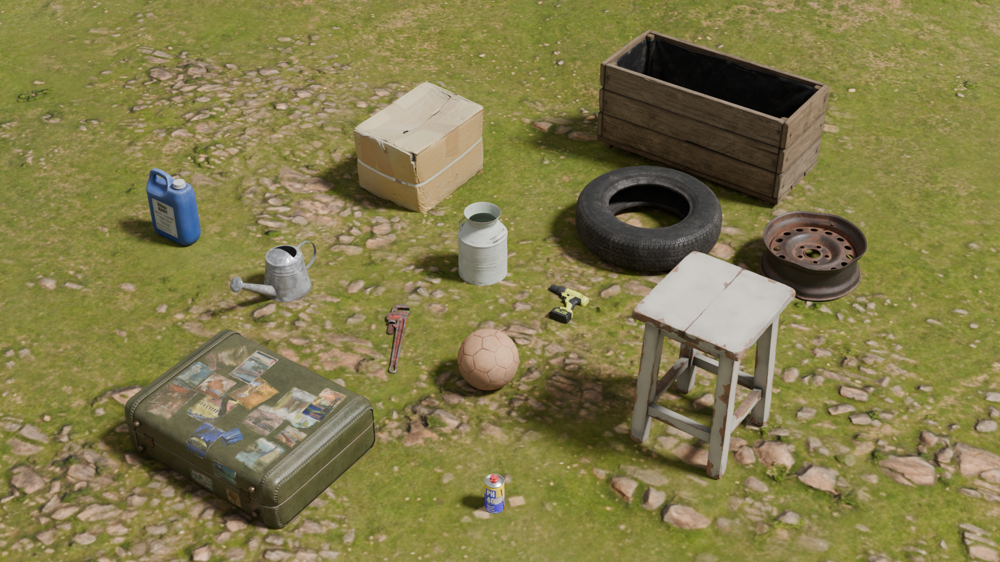

# 이미지 추가4 (2026-07-08)





<a href="../images/test_2026_02_03.png" target="_blank">
  
</a>


<!-- 1. 썸네일 이미지 (클릭 시 팝업을 열도록 설정) -->


<!-- 2. 팝업 창 구조 -->
<dialog id="imgPopup" onclick="if(event.target==this) this.close()" style="border:none; background:none; padding:0; max-width:90vw; max-height:90vh;">
  <div style="position:relative; text-align:center;">
    
    <br>
    <button onclick="document.getElementById('imgPopup').close()" style="margin-top:10px; padding:6px 12px; background:#333; color:#fff; border:none; border-radius:4px; cursor:pointer;">닫기</button>
  </div>
</dialog>


<!-- 1. 썸네일 이미지 (클릭 시 아래 #imgPopup 링크로 강제 이동) -->
<a href="#imgPopup">
  
</a>

<!-- 2. 팝업 창 구조 (CSS target을 이용한 온오프 방식) -->
<div id="imgPopup" style="display: none; position: fixed; top: 0; left: 0; width: 100vw; height: 100vh; background: rgba(0,0,0,0.8); z-index: 9999; justify-content: center; align-items: center; overflow: auto;">
  
  <!-- 팝업 내부 컨테이너 -->
  <div style="position: relative; max-width: 90vw; max-height: 90vh; margin: auto;">
    
    <!-- 우측 상단 닫기 버튼 (X) -> 빈 링크(#)로 이동하여 팝업 닫음 -->
    <a href="#" style="position: fixed; top: 20px; right: 20px; width: 40px; height: 40px; background: rgba(0,0,0,0.5); color: #fff; border: 1px solid rgba(255,255,255,0.3); border-radius: 50%; font-size: 24px; text-decoration: none; text-align: center; line-height: 36px; z-index: 10000;">&times;</a>
    
    <!-- 원본 이미지 (클릭 시 새 탭에서 휠 스크롤 확대가 가능한 진짜 원본 보기로 이동) -->
    <a href="../images/test_2026_02_03.png" target="_blank" title="더 크게 보려면 클릭 (새 탭 휠 확대 지원)">
      
    </a>

  </div>
</div>

<!-- 3. CSS 주입 (자바스크립트 없이 팝업을 켜고 끄는 핵심 스타일) -->
<style>
  #imgPopup:target {
    display: flex !important;
  }
</style>


| 정렬 기준 | 왼쪽 정렬 (텍스트) | 중앙 정렬 (코드) | 오른쪽 정렬 (숫자) |
| :--- | :--- | :---: | ---: |
| 방법 | 콜론을 왼쪽에 | 콜론을 양쪽에 | 콜론을 오른쪽에 |
| 예시 1 | 안녕하세요 | `print()` | 10,000원 |
| 예시 2 | 반갑습니다 | `math.pi` | 55.4% |


| 함수명 | 입력 매개변수 | 반환 값 ($A$) |
| :--- | :---: | :---: |
| `calculate_circle_area(radius)` | 반지름 ($radius$) | **원의 넓이** ($\pi r^2$) |


파이썬 코드 설명  

$A = \pi r^2$

```python
import math

def calculate_circle_area(radius):
    """원의 넓이를 계산하여 반환합니다."""
    if radius < 0:
'''


